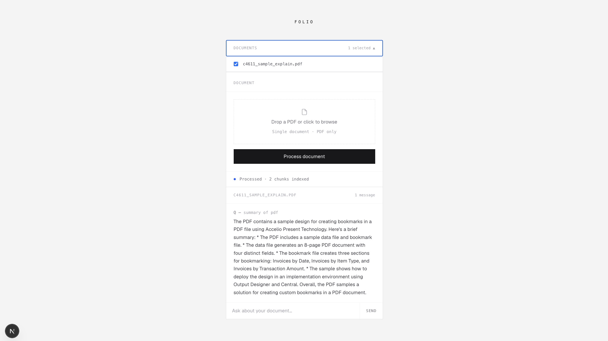

# Folio

A local-first document intelligence tool. Upload PDFs, ask questions, get answers grounded in your documents.



---

## How it works

```
PDF upload
  → extract text
  → split into overlapping chunks (~500 words, 50-word overlap)
  → embed each chunk with nomic-embed-text (Ollama)
  → store vectors in Supabase with pgvector

User question
  → embed question with same model
  → cosine similarity search → top 5 matching chunks
  → inject chunks into LLM prompt
  → llama3.2 answers based only on retrieved context
```

---

## Tech stack

| Layer | Technology |
|---|---|
| Frontend + API | Next.js 15 (App Router, TypeScript) |
| Styling | Tailwind CSS |
| Embeddings | Ollama — nomic-embed-text |
| LLM | Ollama — llama3.2 |
| Database | Supabase (PostgreSQL + pgvector) |
| Duplicate detection | SHA-256 file hashing |

---

## Running locally

**Prerequisites**
- Node.js 18+
- [Ollama](https://ollama.com) installed and running
- A [Supabase](https://supabase.com) project

**1. Clone and install**

```bash
git clone https://github.com/yourusername/folio.git
cd folio
npm install
```

**2. Pull Ollama models**

```bash
ollama pull llama3.2
ollama pull nomic-embed-text
```

**3. Set up Supabase**

Run this in your Supabase SQL editor:

```sql
create extension if not exists vector;

create table documents (
  id bigserial primary key,
  content text not null,
  embedding vector(768),
  file_name text,
  document_id text,
  created_at timestamp with time zone default now()
);

create table uploaded_files (
  id bigserial primary key,
  file_hash text unique not null,
  file_name text,
  document_id text,
  created_at timestamp with time zone default now()
);

alter table documents disable row level security;
alter table uploaded_files disable row level security;

create or replace function match_documents (
  query_embedding vector(768),
  match_count int default 5,
  filter_document_ids text[] default null
)
returns table (
  id bigint,
  content text,
  similarity float
)
language sql stable
as $$
  select
    id,
    content,
    1 - (embedding <=> query_embedding) as similarity
  from documents
  where filter_document_ids is null or document_id = any(filter_document_ids)
  order by embedding <=> query_embedding
  limit match_count;
$$;
```

**4. Environment variables**

Create `.env.local`:

```bash
NEXT_PUBLIC_SUPABASE_URL=your_supabase_url
NEXT_PUBLIC_SUPABASE_ANON_KEY=your_supabase_anon_key
```

**5. Run**

```bash
npm run dev
```

Open [http://localhost:3000](http://localhost:3000).

---

## Project structure

```
app/
  page.tsx              — main UI
  api/
    embed/route.ts      — PDF ingestion pipeline
    chat/route.ts       — question answering pipeline
    documents/route.ts  — fetch uploaded documents list
lib/
  supabase.ts           — Supabase client
  ollama.ts             — Ollama client
  chunker.ts            — text chunking logic
```

